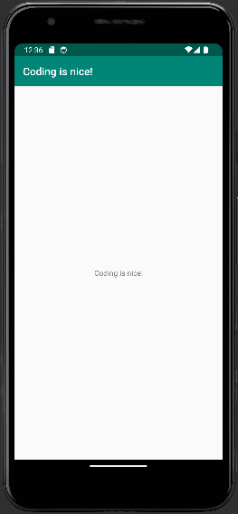

# Rapport

A fork was created of the app "mobileapp-programming-hello" which was then imported into Android Studio.
The files were manually scanned to locate the text "Hello", which was found in the file '/app/res/values/strings.xml'
and looked like this:

```
<resources>
	<string name="app_name">Hello</string>
</resources>
```

The text “Hello” was changed to “Coding is nice!” whereupon the files were saved.
The application was tested successfully using the emulator in Android Studio (see Image 1).

**Bild 1**  <br/><br/>


The commit & push command uploaded the new version of the app to Github along with a comment about what was changed.
A check was performed on Github to confirm that the files were updated.